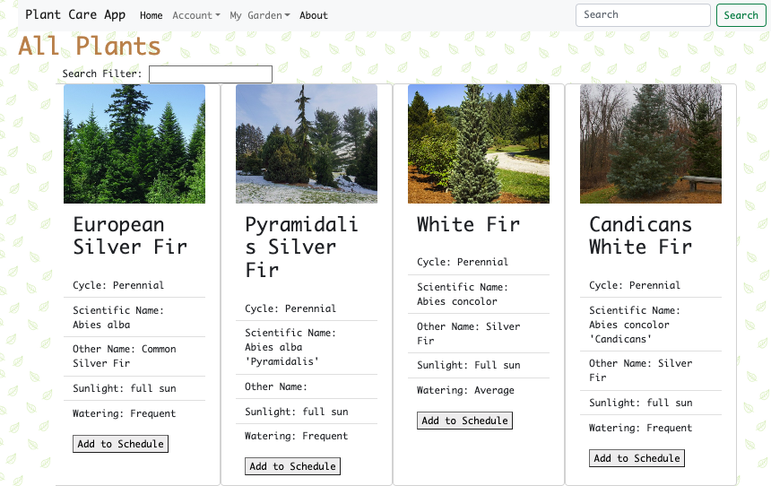

# Plant Care App



Hello fellow plant lovers! Like most beginner plant parents, I tend to forget when or how often to water my plants. To fix this, i've been working on an app that allows you to set watering schedules for your beloved plant babies!

## Table of contents

- [General info](#general-info)
- [Technologies](#technologies)
- [Setup](#setup)

## General info

This project is simple Lorem ipsum dolor generator.

## Technologies

Project is created with:

- Lorem version: 12.3
- Ipsum version: 2.33
- Ament library version: 999

## Setup

To run this project, install it locally using npm:

```
$ cd ../lorem
$ npm install
$ npm start
```

Things you may want to cover:

- Ruby version

- System dependencies

- Configuration

- Database creation

- Database initialization

- How to run the test suite

- Services (job queues, cache servers, search engines, etc.)

- Deployment instructions

- ...
